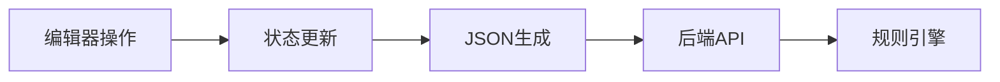
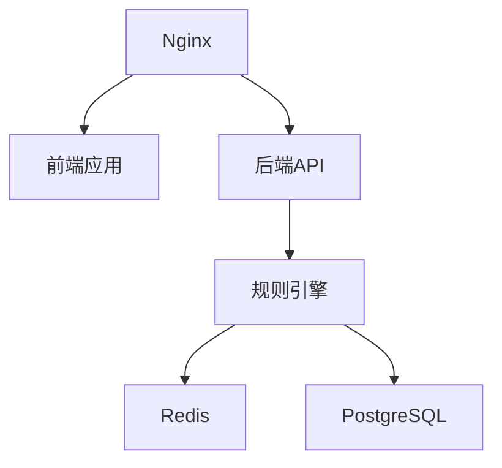

# RuleGo 可视化编辑器设计

## 1. 技术栈选型

- 前端框架: Vue 3 + TypeScript 
- 图形引擎: LogicFlow
- UI 组件: Element Plus
- 状态管理: Pinia
- API 客户端: Axios

## 2. 规则链数据结构

```typescript
// 规则链定义
interface RuleChain {
  id: string;          // UUID
  name: string;        // 规则链名称
  root: boolean;       // 是否为根规则链
  nodes: Node[];       // 节点列表
  connections: Connection[]; // 连接关系
  metadata: Metadata;  // 元数据
}

// 节点定义
interface Node {
  id: string;         // 节点ID
  type_name: string;  // 节点类型
  chain_id: string;   // 所属规则链ID
  config: any;        // 节点配置
  layout: Position;   // 节点位置
}

// 连接关系
interface Connection {
  from_id: string;    // 源节点ID
  to_id: string;      // 目标节点ID  
  type_name: string;  // 连接类型
}

// 节点位置
interface Position {
  x: number;
  y: number;
}

// 元数据
interface Metadata {
  version: number;     // 版本号
  created_at: number;  // 创建时间
  updated_at: number;  // 更新时间
}
```

## 3. 编辑器功能模块

### 3.1 画布操作
- 拖拽添加节点
- 连线操作
- 移动/缩放
- 对齐网格
- 撤销/重做

### 3.2 节点配置
- 基础属性配置
- 节点类型参数配置
- JSON Schema 验证
- 配置模板

### 3.3 规则链管理
- 新建规则链
- 导入/导出
- 版本管理
- 子规则链

### 3.4 调试功能
- 消息模拟器
- 执行路径追踪
- 断点调试
- 日志查看

## 4. API 接口

### 4.1 规则链管理
```typescript
// 获取规则链列表
GET /api/chains

// 创建规则链
POST /api/chains
Body: RuleChain

// 更新规则链
PUT /api/chains/:id 
Body: RuleChain

// 删除规则链
DELETE /api/chains/:id
```

### 4.2 组件管理
```typescript
// 获取组件列表
GET /api/components

// 获取组件配置模板
GET /api/components/:type/template
```

### 4.3 调试接口
```typescript
// 发送测试消息
POST /api/debug/message
Body: Message

// 获取执行日志
GET /api/debug/logs/:messageId
```

## 5. 开发指南

### 5.1 环境准备
```bash
# 安装依赖
pnpm install

# 启动开发服务器
pnpm dev

# 构建
pnpm build

# 测试
pnpm test
```

### 5.2 目录结构
```
src/
  ├── components/     # 组件
  ├── views/         # 页面
  ├── stores/        # 状态管理
  ├── api/           # API封装
  ├── utils/         # 工具函数
  └── types/         # 类型定义
```

## 6. 页面布局

```
+------------------------+
|        Header         |
+------------------------+
|      |                |
| 组件  |     画布        |
| 面板  |                |
|      |                |
+------+----------------+
|      |    属性面板     |
+------------------------+
```

## 7. 数据流转



## 8. 节点配置表单

为每种节点类型定义配置表单:

```typescript
const NODE_FORMS = {
    // 日志节点
    log: {
        template: {
            type: 'textarea',
            label: '日志模板',
            required: true
        }
    },
    
    // 脚本节点
    script: {
        script: {
            type: 'monaco-editor',
            label: 'JavaScript代码',
            language: 'javascript'
        }
    },
    
    // 过滤器节点
    filter: {
        condition: {
            type: 'textarea',
            label: '过滤条件',
            required: true
        },
        js_script: {
            type: 'monaco-editor',
            label: '自定义JS条件(可选)',
            language: 'javascript'
        }
    },
    
    // 转换节点
    transform: {
        fields: {
            type: 'json-editor',
            label: '字段映射',
            required: true
        },
        dropFields: {
            type: 'array',
            label: '删除字段'
        }
    },
    
    // JS转换节点
    transform_js: {
        script: {
            type: 'monaco-editor',
            label: 'JavaScript转换脚本',
            language: 'javascript',
            required: true
        }
    },
    
    // 延时节点
    delay: {
        delay_ms: {
            type: 'number',
            label: '延迟时间(毫秒)',
            required: true,
            min: 0
        },
        periodic: {
            type: 'switch',
            label: '周期性执行'
        },
        period_count: {
            type: 'number',
            label: '重复次数',
            min: 1,
            show: 'periodic'
        }
    },
    
    // 定时任务节点
    schedule: {
        cron: {
            type: 'input',
            label: 'Cron表达式',
            required: true
        },
        timezone_offset: {
            type: 'number',
            label: '时区偏移(小时)',
            default: 8
        }
    },
    
    // REST客户端节点
    rest_client: {
        url: {
            type: 'input',
            label: 'URL',
            required: true
        },
        method: {
            type: 'select',
            label: '请求方法',
            options: ['GET', 'POST', 'PUT', 'DELETE']
        },
        headers: {
            type: 'key-value',
            label: '请求头'
        },
        timeout_ms: {
            type: 'number',
            label: '超时时间(毫秒)',
            default: 5000
        },
        success_branch: {
            type: 'input',
            label: '成功分支名称'
        },
        error_branch: {
            type: 'input', 
            label: '失败分支名称'
        }
    },
    
    // 天气服务节点
    weather: {
        api_key: {
            type: 'password',
            label: 'API密钥',
            required: true
        },
        city: {
            type: 'input',
            label: '城市名称',
            required: true
        },
        language: {
            type: 'select',
            label: '语言',
            options: ['zh', 'en'],
            default: 'zh'
        }
    },
    
    // 子规则链节点
    subchain: {
        chain_id: {
            type: 'select',
            label: '子规则链',
            required: true,
            remote: '/api/chains?root=false'
        },
        output_type: {
            type: 'input',
            label: '输出消息类型'
        }
    }
};
```

## 9. 开发计划

### 第一阶段
- [x] 基础框架搭建
- [x] 规则链列表
- [x] 简单画布操作

### 第二阶段
- [ ] 组件面板
- [ ] 节点配置
- [ ] 连线管理

### 第三阶段
- [ ] 版本管理
- [ ] 导入导出
- [ ] 调试功能

### 第四阶段
- [ ] 在线测试
- [ ] 监控集成
- [ ] 文档完善

## 10. 部署架构



## 11. 安全考虑

1. API 认证
2. CSRF 防护
3. 节点配置验证
4. 用户权限控制
5. 操作审计日志

## 12. 本地开发

```bash
# 安装依赖
pnpm install

# 启动开发服务器
pnpm dev

# 构建
pnpm build

# 测试
pnpm test
``` 